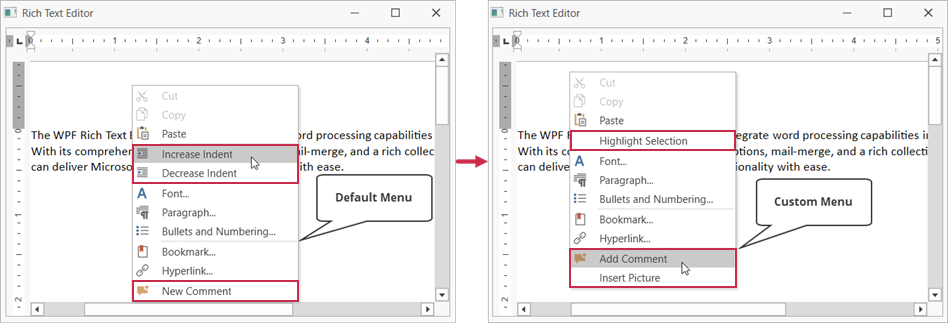

<!-- default badges list -->

<!-- default badges end -->
# WPF Rich Text Editor - How to Customize Context Menus 

This example demonstrates how to customize the [Text](https://docs.devexpress.com/WPF/119034/controls-and-libraries/rich-text-editor/visual-elements/pop-up-menus) context menu of the WPF Rich Text Editor.

Add the required [bar actions](https://docs.devexpress.com/WPF/7045/controls-and-libraries/ribbon-bars-and-menu/bars/bar-actions) to the [RichEditControl.MenuCustomizations](https://docs.devexpress.com/WPF/DevExpress.Xpf.RichEdit.RichEditControl.MenuCustomizations) collection to create, modify or remove menu items.

## Documentation

Refer to the following help topic for implementation details: [Customize Context Menus for the Rich Text Editor](https://docs.devexpress.com/WPF/119036/controls-and-libraries/rich-text-editor/examples/ui-customization/how-to-modify-add-or-remove-items-in-context-menu).

## Files to Look At

* [MainWindow.xaml](./CS/WpfRichEditorMenuCustomization/MainWindow.xaml) (VB: [MainWindow.xaml](./VB/WpfRichEditorMenuCustomization/MainWindow.xaml))
* [MainWindow.xaml.cs](./CS/WpfRichEditorMenuCustomization/MainWindow.xaml.cs) (VB: [MainWindow.xaml.vb](./VB/WpfRichEditorMenuCustomization/MainWindow.xaml.vb))
